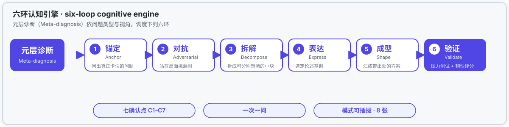

# DiTing — thinking protocol

**A six-loop cognitive engine — from listening to decisive judgment.**

[](LICENSE)
[]()
[]()
[]()


> **DiTing is an AI thinking-protocol (skill). When you're stuck on a vague, tangled problem you can't think your way out of, it does not hand you an answer — it walks you through six rounds of "ask-and-confirm" until the problem is clear, and hands back a decision you signed off on and can live with.**

**English** | [简体中文](README.zh-CN.md)

---

## Start from a scene

Picture yourself at the keyboard, typing a question you've been chewing on for days —

**"Should I really switch careers?"**

Seconds later, the AI replies with a polished answer and three reasons.

But you feel more unsettled, not less.

The answer isn't wrong. It's just **not yours**. You skipped the work of thinking it through, so it can't convince you — and it certainly can't convince the version of you who will wake up at 3 a.m., wondering if you chose wrong.

That is the specific thing DiTing exists to fix.

---

## You don't lack an answer. You lack *thinking it through*.

Most AI interaction is one question, one answer. The thinking step gets skipped.

But for the questions that actually hurt — switching careers, doing a PhD, whether a topic is worth pursuing — you don't lack an answer.

You lack two things:

1. **Clarity** — where exactly you're stuck, what you fear most, what you value most. You have these; you just haven't been able to say them.
2. **Ownership** — a decision you can bear the consequences of. A choice someone else made for you will haunt you even when it works out; a choice you made yourself you can carry through anything.

In one line: **you don't need to be told how to choose — you need to be helped to think yourself clear.**

---

## Why the usual approaches all fall one step short

For "I can't think it through", there are a few standard routes — each one step short:

- **Ask an LLM directly**: it gives you an answer, even a good one. But the answer rests on *it* doing your thinking, skipping your process, so you can't trust the conclusion you're handed.
- **Use a "think step by step" prompt**: it reasons in one long, uninterrupted dump — never turning back to check with you, so the point you actually care about may never be touched.
- **First-principles**: break the problem to its base. Great — but it only gives you one lens. It can't see *your preferences*, because preferences aren't derived; they're **asked out**.

The shared gap: **they all *produce an answer for you* — none of them *help you discover yourself***.

And that step is precisely the one that determines whether you regret it later.

---

## DiTing changes the premise: the answer isn't in the model, it's in you

DiTing can close that gap because it changes the theoretical premise:

> The default AI assumption: **the answer is in the model; you lack it, so it gives it to you.**
> DiTing's assumption: **the answer is in you, just not yet spoken — so its job is to help you *give birth to it*.**

This isn't intuition. It rests on five theoretical pillars:

| Theory | In one sentence | The design decision it produces |
|---|---|---|
| Polanyi · Tacit knowledge | You know more than you can say | Questioning is how the unsayable gets said |
| Slovic · Preference construction | Preferences aren't pre-stored; they form as you're asked | Every confirmation point *builds*, it doesn't collect |
| Socratic maieutics | A teacher doesn't inject; she helps what's inside be born | The whole loop is *asking*, never *answering* |
| Decision-regret theory | Regret hinges on whether the process was yours | Every loop requires your own sign-off |
| Perspectivism | Shifting perspective reveals blind spots, not one right answer | Hence the pluggable thinking-mode library |

In one line: **DiTing is not the teacher who hands you the answer — it's the midwife who helps you deliver your own.**

(Full argument in [`docs/THEORY.md`](docs/THEORY.md))

---

## How it walks you to clarity: the six loops



DiTing breaks "thinking it through" into six loops. Bring in any vague problem, follow it around:

1. **Anchor** — ask out what's *actually* stuck: what you fear, what you want.
2. **Adversarial** — attack it from the opposite side (one key question; you answer before it proceeds).
3. **Decompose** — split the big problem into pieces you can each think through.
4. **Express** — offer you a few tones, lock one in.
5. **Shape** — assemble the full plan, each item tagged with *where that conclusion came from*.
6. **Validate** — stress-test the plan with light (3 checks) or heavy (5 checks) verification, then score its resilience.

Three disciplines run through all of it:

- **Seven confirmation points**: every loop stops to ask "is this right?" — never a silent pipeline.
- **One question at a time**: ask one, wait for your answer, move on; stop at 95% confidence.
- **Pluggable modes**: eight mental-model cards (Qiushi, Feynman, Munger…) — borrow *how they think*, never role-play a person.

Come out the other side and you don't get advice — you get **a decision you confirmed + where it came from + a validation report**.

---

## Compared with other tools, what exactly does it add?

Same question, three routes: *"Should I switch careers?"*

| | Ask an LLM directly | "Think step-by-step" prompt | **DiTing** |
|---|---|---|---|
| What you get | An answer | A long chain of reasoning | **A decision you signed off on** |
| Whose answer | The model's | The model's | **Yours** |
| Did you take part? | No — thinking was skipped | Barely — it dumps output | **Every loop pauses to check with you** |
| Are you sure afterward? | Not really, still torn | Maybe not — it may miss your point | **Yes — you built it step by step** |
| Next time | Start from zero | Start from zero | **You get better (traces/profile/bank accumulate)** |

DiTing isn't trying to outsmart them. It adds something else:

- **Confirmation-feedback loop**: every time you choose, it echoes back *"choosing this means you value…"* — making your preferences visible.
- **Dual-level validation**: a conclusion has to survive being picked at before it reaches you.
- **Long-term accumulation**: thinking traces, preference profile, perspective bank — all stored locally, growing more useful over time.
- **A theorizing partner**: on research questions, it presses your intuition into *a rebuttable claim* rather than handing you a conclusion — exactly the step that surfaces hidden theories.

---

## Where it fits

| Scenario | Example |
|---|---|
| **Big decisions** | Career switch, PhD, staying or leaving… anything you'll carry for a long time |
| **Academic research** | Is this topic worth it? Does the argument hold? How to rebut myself? — and, crucially, sorting scattered intuition, literature and experience into an arguable theoretical thread, exposing hidden dimensions under adversarial testing |
| **Writing & creation** | Outline structure, tone, a direction you keep second-guessing |
| **Workplace** | Argument for a proposal, how to handle conflict, negotiation moves |
| **Self-growth** | What do I actually value? Debrief the last decision |

**The boundary, in one line: any problem with no standard answer — but which *you* must think through and own — is DiTing's home turf.**

---

## Academic research: how it helps you *think* a hidden theory into being

For humanities and social-science researchers, DiTing's most underrated value isn't "helping you decide" — it's **walking with you until a research intuition is thought through, and pressing out a theory-claim that can be discussed and rebutted**.

The common trap in research isn't "no idea". It's this: you hit an anomaly in the field or the literature — your gut says the standard explanation doesn't hold — but it stays in your head as a vague discomfort: unwriteable, unarguable. You don't need more literature; you need an opponent who will **sort, probe, and steelman** with you.

Here the six loops walk through one generalized research scene (pointing to no individual):

> **The researcher's intuition**: Studying neighborhoods, I found that in some renovated old communities the original residents actually interact *more* than before. That contradicts the commonsense view that renewal drives old residents apart. I feel there's a thesis in there, but I can't say it.

- **Anchor** — What's really stuck isn't a case, but a *mechanism* question: "what does spatial renewal actually change"? Are you asking "the physical environment shapes interaction", or "symbolic space reshapes identity and belonging"? That one question turns a fuzzy anomaly into a researchable claim.
- **Adversarial** — If urban renewal necessarily dissolves original residents' social networks (the classic gentrification thesis), this community is a counter-example; yet experience shows people do linger more in the renewed public space. Where does the contradiction bite? This strike reveals the hard core of your intuition.
- **Decompose** — Split the "renewal effect" into two layers: **(1) commercialization of space** (shops crowd out everyday life); **(2) livification of space** (markets and chess corners preserved, daily rhythm kept). The distinction you hadn't drawn — and that decides everything.
- **Express** — Lock the register: cool, argumentative, hedged.
- **Shape** — The claim emerges: renewal need not expel neighborliness; when the renovation keeps *livification* rather than pure *commercialization*, the space's new visibility actually reactivates dormant neighborhood ties. Each conclusion tagged with *where it came from*.
- **Validate** — Lynch-hypothesis scan: does the claim survive "renewal will eventually displace the population"? Resilience 7.5/10, with a note to add a micro-mechanism (how visibility concretely turns into visit frequency).

Walk the circle and you don't get "a ready answer" — you get **a claim you derived yourself, know the boundaries of, and can take into argument**. That is the most precious step in humanities research: turning a hazy intuition into knowledge that can enter public discussion.

(More theory-dialogue examples in [`docs/THEORY.md`](docs/THEORY.md))

---

## Up and running in three minutes

### Install

```bash
# Option A: copy the skill into your agent's skill directory (WorkBuddy / Claude / etc.)
cp -r skill/thinking-protocols ~/.workbuddy/skills/

# Option B: clone and symlink
git clone https://github.com/<your-name>/DiTing-Protocol.git
ln -s "$(pwd)/DiTing-Protocol/skill/thinking-protocols" ~/.workbuddy/skills/thinking-protocols
```

### First use

1. Copy the empty templates from `data/_templates/` into `data/traces|profiles|perspectives/`;
2. Trigger it with any of: `help me think this through` / `I want to think this deeply` / `ask me first, don't rush to write`.

### A minimal dialogue (generalized)

```
You:    I've been in a stable but stagnant job for three years. I want to switch fields but fear the risk — I can't decide.
DiTing: Which do you fear more — "it gets worse after switching", or "a lifetime of regret if you don't"?
You:    Honestly, the latter.
DiTing: (Anchor) So is the real tension "unknowable risk", or "identity crisis"?
You:    Identity crisis.
DiTing: (Adversarial) If "start a low-risk side-project probe first" holds, what's its weakest objection?
...
DiTing: (Validate → deliver) Plan + where each conclusion came from + validation report.
        → Echo: you chose "low-risk probe first", which means you value reversibility.
```

---

## Architecture

```
DiTing-Protocol/
├── README.md / README.zh-CN.md   # This document
├── LICENSE                        # MIT
├── skill/
│   └── thinking-protocols/
│       ├── SKILL.md               # Orchestrator: diagnose → six loops → validate
│       └── references/            # Rule files (loaded per loop, not all at once)
│           ├── meta-diagnosis.md  # Diagnosis: classification / perspectives / modes / constraints
│           ├── socratic-questioning.md / layered-questioning.md   # Anchor
│           ├── steelman.md        # Adversarial
│           ├── four-quadrant.md   # Decompose
│           ├── style-calibration.md # Express
│           ├── validation.md      # Validate (light / heavy)
│           ├── trace-log.md / preference-profile.md / perspective-bank.md / mode-training.md
│           └── modes/index.md     # Eight pluggable mode cards
├── data/                          # NEVER committed (see .gitignore)
│   └── _templates/                # Empty templates to copy on first use
└── docs/
    └── THEORY.md                  # Extended theory
```

---

## Privacy & contributing

Pull requests welcome; open an issue first for major changes.

**Community rule — privacy first:** rules and templates may be improved freely; **real user data (traces / profiles / banks) must NEVER be committed** — use the templates under `data/_templates/` for examples.

---

## License

[MIT](LICENSE) © Ruojun
